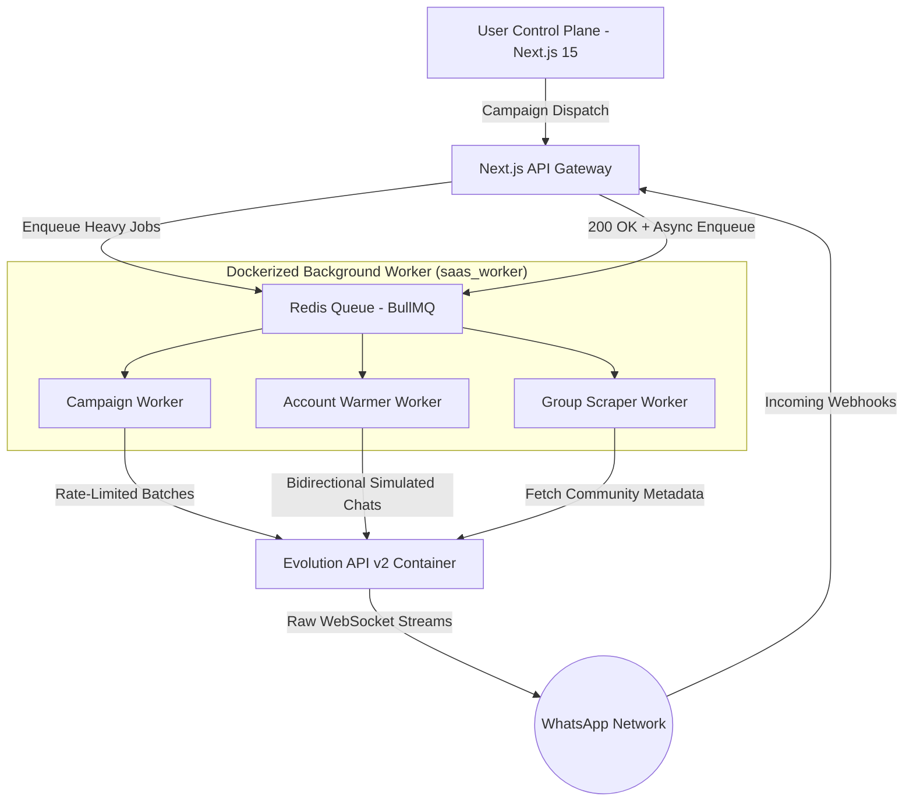

# ⚡ High-Throughput WhatsApp Infrastructure & Anti-Ban Automation Engine (Showcase)

> **Note:** The source code for this platform is proprietary and closed-source. This repository serves as a technical showcase of the architectural patterns, socket lifecycle management, and distributed event-driven challenges solved while building **Whalinkbot** ([whalinkbot.com](https://whalinkbot.com)).

---

## 📌 Executive Overview

**Whalinkbot** is an enterprise-grade outbound messaging infrastructure and lead generation engine for WhatsApp. It solves the hardest challenges in automated messaging: avoiding Meta account bans through biometric/heuristic warming algorithms, handling high-throughput webhook bursts without dropping packets, scraping group participants through obscured identifiers, and recovering from corrupted socket session states in real-time.

### 📊 Scale & Engineering Metrics
* **Core Stack:** Next.js 15 (App Router), React 19, TypeScript, PostgreSQL (Prisma ORM).
* **Distributed Processing:** BullMQ + Redis running in isolated containerized background workers (`saas_worker`).
* **Socket & Protocol Layer:** Dockerized Evolution API v2 (Baileys socket engine).
* **Test Coverage:** Automated Unit/Integration suites with Vitest + Full E2E regression pipelines with Playwright.

---

## 🛠 Tech Stack

* **Frontend & Control Plane:** Next.js 15, TailwindCSS v4, Lucide React
* **Backend & API Layer:** Next.js Server Components, Server Actions, Route Handlers
* **Database:** PostgreSQL with Prisma ORM (Optimized indexes for bulk lead insertion)
* **Message Broker & Task Queue:** BullMQ + Redis (Dedicated queue workers)
* **WhatsApp Engine:** Evolution API v2 / Baileys WebSocket integration
* **Infrastructure:** Multi-container Docker Compose setup (`saas_app`, `saas_worker`, `saas_db`, `saas_redis`, `saas_evolution_api`)
* **Testing:** Vitest, Testing Library, Playwright E2E

---

## 🏗 System Architecture & Key Engineering Solutions

---

### 1. The Autonomous "Account Warmer" Engine (Anti-Ban Heuristics)
**The Challenge:** Newly registered WhatsApp business numbers get banned almost immediately if they send bulk messages without a prior conversational history.

**The Solution:**
* Engineered a bidirectional chat simulation engine (`warmerWorker.ts`) driven by BullMQ.
* The system manages pairs of numbers categorized into `MAIN` and `WARMER` roles.
* Mathematical variance models calculate randomized inter-message delays (20–45s) and inject simulated human typing states (`presence: "composing"`) proportional to message string length before dispatching.
* Guarantees strict role separation at the database level so warming accounts are never co-mingled with active marketing campaigns.

---

### 2. High-Burst Webhook Ingestion & 504 Timeout Elimination
**The Challenge:** During mass broadcast campaigns, WhatsApp delivers thousands of concurrent read receipts (`messages.update`) and incoming replies simultaneously. Performing synchronous database writes inside the Next.js API route caused `504 Gateway Time-out` errors and dropped webhooks.

**The Solution:**
* Decoupled webhook reception from ingestion: the API route immediately acknowledges Evolution API with `200 OK` in <10ms after pushing the raw payload to BullMQ (`webhookQueue`).
* The dedicated `webhookWorker` in `saas_worker` drains the queue asynchronously, batching database updates for delivery acknowledgments (`DELIVERY_ACK`) and read statuses (`READ`, `PLAYED`).

---

### 3. Community Participant Scraper & Privacy ID Resolution
**The Challenge:** WhatsApp masks group participant phone numbers using privacy-preserving JIDs (`@lid`) rather than standard phone numbers (`@s.whatsapp.net`), making lead generation from groups difficult.

**The Solution:**
* Developed the `GroupScraperWorker` which queries group metadata via Evolution API and performs heuristic resolution between `@lid` and actual phone numbers.
* Implemented database bulk upserts in chunks of 500 records with conflict targets (`ON CONFLICT DO NOTHING`) to process massive community groups without locking PostgreSQL tables.

---

### 4. Self-Healing Zombie Baileys Session Recovery
**The Challenge:** Baileys sessions can enter a corrupted "zombie" state where the internal socket reports `open`, but the physical phone shows no linked device. Standard logout API calls return `500 Connection Closed`.

**The Solution:**
* Implemented a sequential **Double Strategy (Logout + Delete)**:
  1. Issues an atomic socket teardown request.
  2. Simultaneously forces a database cleanup of cached tokens and credentials in the Evolution database.
  3. Soft-deletes group campaigns so that if the user reconnects the instance, campaign states are preserved rather than cascade-deleted.

---

## 🌐 Live Product
* **Production Platform:** [Whalinkbot.com](https://whalinkbot.com)
* **Parent Organization:** Servitecnology

---

## 👨‍💻 About the Architect
I am a **Senior Full Stack & Lead Software Engineer** specializing in high-concurrency event-driven architectures, messaging protocols, and distributed cloud systems.

* **GitHub:** [@angelgleon2014](https://github.com/angelgleon2014)
* **LinkedIn:** [Angel Gerardo Leon Alvarez](https://www.linkedin.com/in/angel-gerardo-leon-alvarez/)
* **Portfolio:** [angelgleon2014.github.io](https://angelgleon2014.github.io/angelgerardoleonalvarez)
